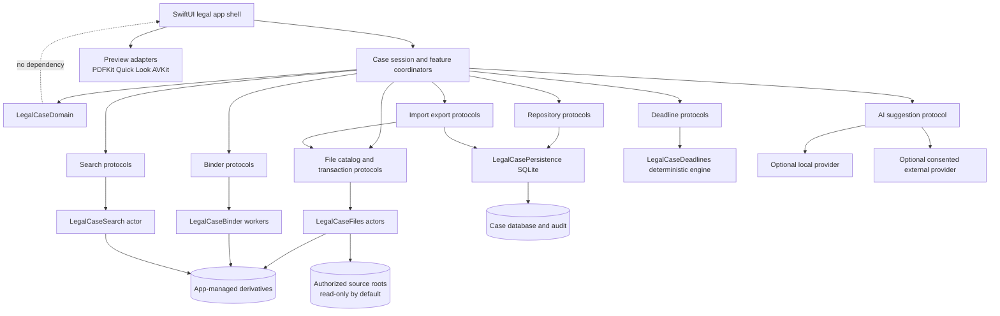

# Architecture baseline

## Current architecture

The package has a SwiftUI executable (`FactoryDesktop`) depending on one Foundation/SQLite core (`FactoryDesktopCore`). `FactoryDesktopApp` owns WindowGroups and menus; `ContentView` uses `NavigationSplitView` plus an optional `HSplitView` inspector. A single `@MainActor AppStore` constructs concrete dependencies, opens/migrates one SQLite database, loads arrays, coordinates Git/runner/AI workflows, and publishes UI state. `FactoryRepository` owns concrete SQL CRUD. `CommandRunner`, `GitService`, runner adapters, a process-registry actor, Markdown store, and migration runner provide narrower seams.

Strengths worth preserving as patterns are native macOS scene/split/inspector behavior, explicit review gates, SQLite transactions and numbered migrations, pre-migration backup, typed process arguments, cancellable process handles, restart detachment, dependency injection used in tests, and strong current core coverage.

Concrete limitations are product-domain mismatch; fixed `~/.factory` ownership; one global DB/store/repository; paths as strings; no security bookmarks/case lock; no file catalog/watcher/index; no general transaction/recovery journal; and tight UI/workflow/persistence coupling. Legal features must not accumulate inside `AppStore`, `FactoryRepository`, `Models.swift`, or the existing database.

## Recommended smallest sustainable evolution

Resolve ADR-0001, then add a separate legal package boundary rather than relabeling coding models. The default recommendation is a new executable/target and modules in the same package during transition, with the current product retained unchanged until an explicit retirement task. Start as a modular monolith: compiled domain/service protocols and separate targets where they enforce integrity or concurrency, not dozens of premature packages.

Recommended target-level boundaries:

- `LegalCaseDomain`: value types, identities, invariants, state machines; no UI, filesystem, SQLite, PDF, network.
- `LegalCasePersistence`: case/workspace repositories, schema/migrations, audit atomicity, backups/locks.
- `LegalCaseFiles`: authorized roots, catalog, identity/hash, watcher, transaction journal/recovery.
- `LegalCaseDocuments`: preview adapters, extraction, Quick Look/PDFKit/AppKit bridges exposed as protocols.
- `LegalCaseBinder`: pure page-plan/validation core plus generation adapter; never source-write.
- `LegalCaseSearch`: versioned index and OCR adapters.
- `LegalCaseDeadlines`: deterministic suggestion engine with external reviewed rule references.
- `LegalCaseImportExport`: staged plans, manifests, reports, package/restore.
- `LegalCaseAI`: optional provider adapters producing only `AISuggestion`.
- legal SwiftUI executable: scenes, navigation, feature stores/read models, AppKit interoperability.

Targets may initially be directories within fewer compiled modules if package build cost requires it, but the dependency rules and protocols below are mandatory.

## High-level dependencies

Dependency direction is inward: domain knows nothing about infrastructure; service protocols use domain IDs/value types; infrastructure implements protocols; UI composes services. Preview/search/binder/AI cannot write authoritative domain records directly. File mutations occur only through `FileTransactionService`; audit writes occur atomically with authoritative database changes.

## Boundary decisions

| Boundary | Owner and rule | Test seam |
|---|---|---|
| Application/scenes | SwiftUI `App`, one workspace/case session per window; menus route typed commands | In-memory session/router and UI tests |
| Navigation/window | Stable `CaseRoute` IDs, restoration state non-authoritative; multiple document comparison windows allowed | Stale/deleted route fixtures |
| Case workspace | `WorkspaceProfileService` authorizes roots; `CaseSession` owns scoped actors and generation token | Fake capabilities and switch-race harness |
| Persistence | Case repositories and Unit of Work; case DB authoritative for records, workspace DB only profiles/recents | In-memory/temp SQLite and migration goldens |
| File catalog | Actor serializes scans/events; watcher hints cause reconciliation; stable identity not path | Synthetic volume/files/watcher events |
| Original files | Read-only by default; byte changes forbidden; optional approved path-only operations through journal | Hash-before/after and boundary fixtures |
| Derivatives | App-managed, content-addressed/revision-bound, regenerable; never authority for original | Temp derivative store and manifest verifier |
| File transaction | Typed plan → validate → approval digest → journal → execute → verify → audit; compensating rollback | Failure/kill injection after every step |
| Search index | Disposable projection keyed to record/file versions; stale never presented as current | Fake clock/index and version changes |
| Preview | Renderer protocol returns state/position/citation; UI selection generation cancels old work | Fake delayed/crashing renderer |
| Binder | Pure page plan/validator precedes worker generation; atomic publication only | Generated PDFs/golden manifests |
| Deadline | Pure calculations output suggestions; repository confirmation is separate user command | Fake calendar/rule source/clock |
| Import/export | Staged immutable plan, validation, manifest, atomic commit/publish | Fault-injected staging destination |
| AI | Provider receives explicit disclosure scope and can only persist suggestion/audit | Fake hallucinating/offline provider |
| Audit | Per-case append-only event ledger; user activity projection separate from diagnostic log | Event matrix/atomicity tests |
| External commands | Avoid for core; typed dedicated adapters only where native API unavailable; no general user shell | Fake executor and allowlisted typed request tests |
| Error/recovery | Stable error codes and durable recovery records, surfaced in Error Center | Restart/kill/corruption fixtures |

## Concurrency and background work

UI-facing stores and navigation are `@MainActor`. Persistence writes use a case-scoped serial executor/actor with explicit transaction APIs. Catalog/watcher, hashing, search indexing, OCR, binder, import/export, backup, and file transactions are isolated actors or bounded task groups. Each request carries workspace ID, case ID, session generation, cancellation token, and input version. Results are published only if all still match.

Durable jobs persist checkpoints before side effects. Cancellation stops at declared safe points. A restart never infers completion from a file's presence alone; it reconciles journal, manifest, hashes, and database state.

## Configuration and migration ownership

Workspace profile service owns roots/bookmarks/capabilities and app-wide integration settings. `Case` owns case policies and export/confidentiality defaults. Feature services own no personal paths. Secrets belong in Keychain or provider-specific secure storage, not exported profiles/case DB unless explicitly designed.

Workspace schema, case schema, search-index schema, export-package schema, and binder manifest version independently. The persistence target owns case DB migrations and mandatory preflight backup. Index/cache formats may be deleted/rebuilt; authoritative DB/package migrations may not.

## Architectural decisions required before implementation

1. ADR-0001 target/product disposition (blocking Phase 0).
2. App Sandbox distribution and bookmark lifecycle.
3. Case DB location: inside derivative root/package versus app container with portable export (default: case package/managed case support directory, explicitly chosen).
4. Original hard-link default (recommended: block physical mutations; allow catalog/preview read-only).
5. SQLite concurrency wrapper and Unit-of-Work API.
6. PDF normalization/rendering implementation and acceptable cross-version determinism.
7. Audit tamper-evidence/retention/encryption requirements.
8. Supported rule-source governance before deadline formulas.
9. Public package encryption/key recovery and multi-user access, if any.

## Enforcement for implementation tasks

No legal implementation task may add legal state to existing coding tables or use `AppStore`/`FactoryRepository` as its owner. Each task names feature IDs, boundary protocol, migration owner, source-file effect, recovery path, and same-task tests. Cross-boundary convenience imports require an ADR.
