# Binder pipeline

## Governing invariants

- Binder input is a locked/draft `BinderRevision` referencing exact `ExhibitRevision` and `ExhibitPage` records; not mutable “latest file” paths.
- Every output page resolves to an exhibit revision and source FileVersion/page or to a declared generated cover/separator/blank page.
- Normalization and rendering operate only in app-managed staging/derivative storage. Original hashes and bytes remain unchanged.
- Draft and final outputs publish atomically with a manifest/hash. A partial file is never displayed as a completed binder.
- A finalized binder revision is immutable. Reopening creates a successor revision and preserves prior output/manifest.

## Pipeline

```mermaid
flowchart LR
    PLAN[Binder draft\nvolumes exhibits profiles] --> SNAP[Freeze input snapshot\nIDs versions hashes]
    SNAP --> PREFLIGHT[Preflight\npermissions missing inputs disk]
    PREFLIGHT --> PAGEPLAN[Pure page plan\norder transforms labels ranges]
    PAGEPLAN --> VALIDATE[Blocking/advisory validation]
    VALIDATE --> NORM[Normalize into derivatives]
    NORM --> ASSEMBLE[Assemble covers TOC separators pages]
    ASSEMBLE --> PAGECHECK[Render/reconcile page count labels ranges duplicates]
    PAGECHECK --> STAGE[Stage PDF volumes manifest index hashes]
    STAGE --> PREVIEW[Preview and user review]
    PREVIEW --> PUBLISH[Atomic publish draft/final ExportRecord]
```

`PAGEPLAN` and validation should be pure deterministic code. Rendering adapters are replaceable and produce explicit tool/framework/version metadata. Cache keys include every input version and transform; cache misses affect speed only.

## Page plan and validation

Each planned page includes volume/ordinal, output label, kind, exhibit/revision/page identity, source FileVersion and source page/region, crop/rotation/redaction/normalization transform, template component version, and expected dimensions. The reconciler independently reads generated PDFs and proves count/labels/ranges/volume boundaries against the plan.

Blocking validation includes missing/unreadable source, out-of-range page, unresolved duplicate/collision, failed normalization/render, page-count/label/range mismatch, broken exhibit revision, insufficient disk, or invalid finalization state. Advisory checks include low resolution, unusual orientation/crop, blank/duplicate-looking pages, redaction-review state, confidential marking, large volume, and number gaps. Overrides are versioned, reasoned, and cannot waive structural reconciliation.

## Incremental generation and recovery

The durable job graph checkpoints snapshot, page plan, each normalized input, each assembled volume, reconciliation, manifest, and publish. A changed input invalidates dependent nodes and marks prior previews stale. Cancellation preserves the last published revision/output and deletes or journals staging. Restart resumes only after input/version verification; otherwise it offers restart/cleanup.

## Outputs

Per-volume PDF, binder manifest (JSON plus human report), exhibit index/joint list when selected, exact exhibit ranges, validation report, output hashes, generation/framework metadata, exclusions and overrides. Court/exchange profiles omit internal strategy and absolute local paths. Internal profiles must still preview disclosure.

## Acceptance gates

Golden mixed-size/orientation/image/PDF fixtures, 0/1/multi-volume, continuous/per-exhibit labels, cover/separator/blank insertion, duplicate/missing pages, corrupted/encrypted PDF, cancellation and every kill point, low disk, stale source, deterministic rerun, prior revision reproduction, visual render comparison, print-safe page sizes, and manifest verification are required before finalization is enabled.
