# Date and deadline model

## Separation of concepts

`TimelineEvent` records what factually happened. `CalendarEvent` records a scheduled court or preparation event. `Deadline` records a candidate and/or user-confirmed due date. A hearing may have all three related records, but none is the other.

Dates use a typed temporal value with precision, all-day/timed semantics, time zone, source citation, origin, confirmation state, and history. Unknown/approximate values stay unknown/approximate; display and sorting may not invent precision.

## Suggestion and confirmation

```mermaid
stateDiagram-v2
    [*] --> Suggested: trigger + reviewed rule reference + calculation
    Suggested --> Confirmed: user explicitly confirms or edits
    Suggested --> Rejected: user rejects with optional reason
    Suggested --> Superseded: trigger/rule changes
    Confirmed --> Confirmed: manual reschedule creates history
    Confirmed --> ReviewRequired: trigger/rule change creates new suggestion
    ReviewRequired --> Confirmed: user keeps or accepts edited/new date
    ReviewRequired --> Rejected: user rejects candidate; old confirmed remains
```

A suggestion stores triggering event/version, rule reference/version/effective dates/jurisdiction, formula inputs, calendar/time-zone/excluded-day policy, intermediate calculation, result, engine version, and generated time. Confirmation stores the original suggestion plus confirmed date, actor/time, edits and rationale. There is no API that overwrites a confirmed date during recalculation.

## Rule boundary

The deterministic engine evaluates typed formulas supplied by a reviewed `DeadlineRuleReference` registry. It does not use AI for arithmetic or legal authority. No jurisdiction-specific rule is added in this planning task. Future rule content needs source licensing, reviewer/approval governance, effective-date/supersession handling, golden examples, and an ADR.

AI or extraction may propose a triggering event/date or candidate source citation; it cannot publish a rule, calculation, or confirmed deadline. Missing/ambiguous jurisdiction, trigger, service method, time zone, holiday calendar, or excluded-day setting yields an incomplete suggestion requiring review, not a guessed answer.

## Recalculation and dependencies

Trigger/reschedule/rule changes enqueue a new calculation lineage. The UI shows old confirmed date, new suggestion, exact differences and affected tasks/reminders. Until user action, confirmed date and reminders remain unchanged; optionally an additional review warning appears. Recurring events and external calendar changes follow the same rule.

## Tests

Pure formula tests; exact/inclusive/exclusive counting; weekends/holidays/excluded days; all-day/timed/time-zone/DST; trigger version change; rule effective-date change; missing inputs; manual override; rejected/superseded history; repeated idempotent recalculation; external calendar conflicts; confirmation authorization; dashboard/export distinction; and explicit proof that no background calculation mutates confirmed fields.
