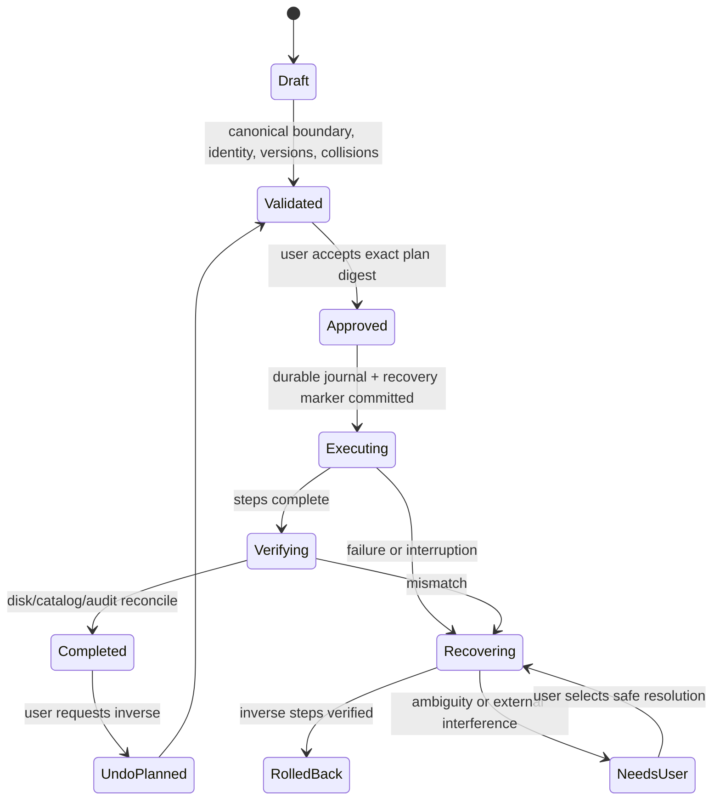

# File safety model

## Storage classes

1. **Original source:** user-controlled bytes under an authorized case root. Read-only to all normal services. Cataloging, preview, hashing, extraction, evidence/exhibit work, binder generation, search, export, and AI do not modify it.
2. **Managed source copy:** optional approved byte-for-byte copy into case-managed storage, verified by hash and retaining origin provenance. It becomes an original within the managed case policy.
3. **Working derivative:** conversion, OCR, redaction, annotation, crop, rotation, normalized PDF, thumbnail, index text, or temporary page. Regenerable, lineage-bound, never silently substituted for source.
4. **Final generated derivative:** locked exhibit/binder/report/export output with manifest/hash. Preserved by revision but never reclassified as source evidence automatically.
5. **Disposable cache/temp:** previews, indexes, staging. Rebuildable and safe to prune according to recovery journal.

## Read boundary

Every file request carries workspace ID, case ID, authorized root ID, stable CaseFile/FileVersion ID, canonical URL, expected identity/version, and required capability. The security service resolves the real path, verifies containment and bookmark access, inspects symlink/hard-link/risky-file policy, and returns a scoped handle. String-prefix containment is forbidden.

Watcher events are untrusted hints. Reconciliation stats the filesystem and updates catalog state. An ambiguous move/replacement produces candidates, never an automatic relink.

## Mutation protocol

Only `FileTransactionService` may perform product-initiated physical source-path changes, and only for `ORG-*` features.

The plan contains typed steps, exact source/destination, stable identity, expected hash/version, reason, affected records, collision resolution, preconditions, inverse/compensating action, and whether bytes/path/metadata change. Approval binds a digest. Any drift invalidates approval.

Execution uses same-volume atomic rename when available, never overwrite semantics, staged copy plus hash plus publish for cross-volume moves, and directory fsync/coordination where applicable. Cross-volume source removal occurs only after destination verification and policy approval. Batch all-or-nothing is implemented with compensation, not falsely claimed filesystem atomicity.

## Rollback, undo, and recovery

- Journal state is durable before each side effect and idempotent after restart.
- A failed operation either verifies pre-state restoration or remains `NeedsUser`; it never disappears behind a generic error.
- Undo creates a new inverse transaction after revalidating current disk state. It never overwrites a newer external file.
- Catalog and domain relationship updates commit only with verified file state and matching audit event. If cross-resource atomicity is impossible, the recovery record is the authority for reconciliation.
- Recovery mode compares journal, stable identities, hashes, paths, and DB state. Presence of a filename is insufficient proof.

## Safety rules

- Catalog load is read-only and cannot trigger folder creation, rename, move, normalization, or AI suggestion application.
- Originals are never overwritten, recompressed, redacted, annotated, converted, or content-edited.
- CaseFile metadata stays in the database initially. Finder tags/xattrs are a future opt-in feature requiring a new feature ID/ADR.
- Symlinks are not followed for mutation. Escapes/loops block catalog descent by default. Hard-linked files may be cataloged read-only; physical mutation is blocked unless a future approved safe-copy policy applies.
- Unsupported/executable/malformed inputs are never auto-executed. External open warns that another app may modify originals.
- Temp/staging locations are explicitly authorized/app-managed, have disk-space checks and cleanup journals, and never expose partial output as final.
- Hashes validate identity/integrity; they do not establish authenticity or chain of custody by themselves.

## Required transaction tests

Canonical containment, Unicode/case normalization, symlink loop/escape, hard links, case-only rename, collisions, duplicate batch targets, permissions, locked/open files, volume disconnect, insufficient space, cross-volume copy, changed-during-plan, changed-during-execution, cancellation, crash after every journal/side-effect boundary, rollback conflict, undo after external change, watcher reordering, DB commit failure, audit failure, and catalog reconciliation. Every fixture records original hashes before/after.
